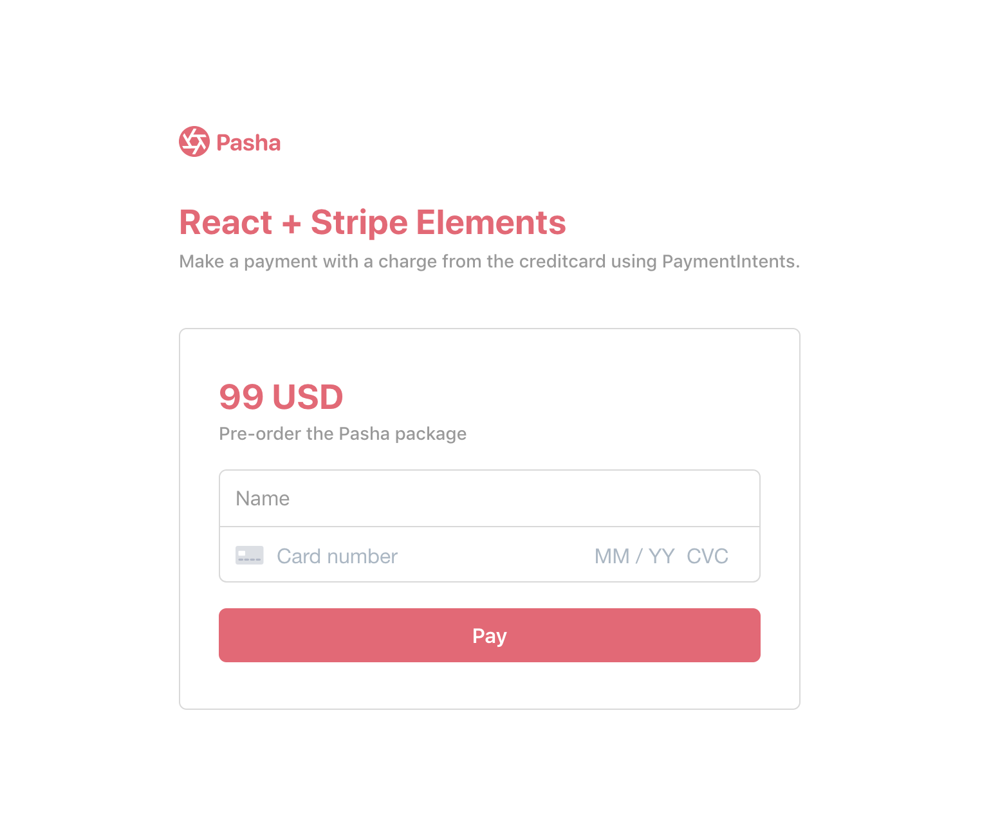

# Card Payment using React

This sample shows how to build a card form to take a payment using the [Payment Intents API](https://stripe.com/docs/payments/payment-intents), [Stripe Elements](https://stripe.com/payments/elements) and [React](https://reactjs.org/).

See a hosted version of the [demo](codesandbox.io/) in test mode or [fork on codesandbox.io](https://codesandbox.io)



## Features

This sample consists of a `client` in React and a `server` piece available in 5 common languages.

The client is implemented using `create-react-app` to provide the boilerplate for React. Stripe Elements is integrated using [`react-stripe-elements`](https://github.com/stripe/react-stripe-elements), which is the official React library provided by Stripe.

The server includes [5 server implementations](server/README.md) in Node, Ruby, Python, Java, and PHP in the [/server](/server) directory. We included several RESTful server implementations, each with the same endpoints and logic.

## How to run locally

To run this sample locally you need to start both a local dev server for the `front-end` and another server for the `back-end`.

You will need a Stripe account with its own set of [API keys](https://stripe.com/docs/development#api-keys).

If you want to run the recipe locally, copy the .env.example file to your own .env file in this directory:

```
cp .env.example .env
```

### Running the back-end API

1. Go to `/server`
1. Pick the language you are most comfortable in and follow the instructions in the directory on how to run.

### Running the React front-end

1. Go to `/client`
1. Run `yarn`
1. Run `yarn start` and your default browser should now open with the front-end being served from `http://localhost:3000/`.

### Using the sample app

When running both servers, you are now ready to use the app running in [http://localhost:3000](http://localhost:3000).

1. Enter your name and card details
1. Hit "Pay"
1. 🎉

## FAQ

Q: Why did you pick these frameworks?

A: We chose the most minimal framework to convey the key Stripe calls and concepts you need to understand. These demos are meant as an educational tool that helps you roadmap how to integrate Stripe within your own system independent of the framework.

Q: Can you show me how to build X?

A: We are always looking for new recipe ideas, please email dev-samples@stripe.com with your suggestion!

## Author(s)

[@auchenberg-stripe](https://twitter.com/auchenberg)
